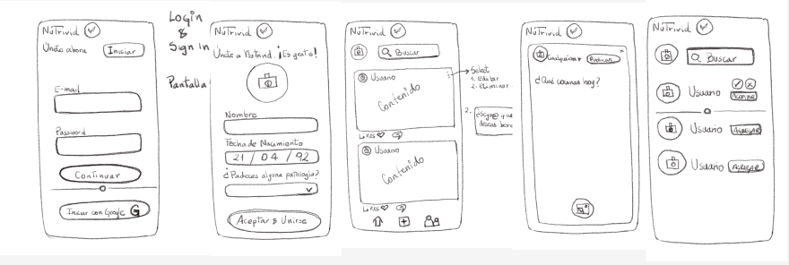
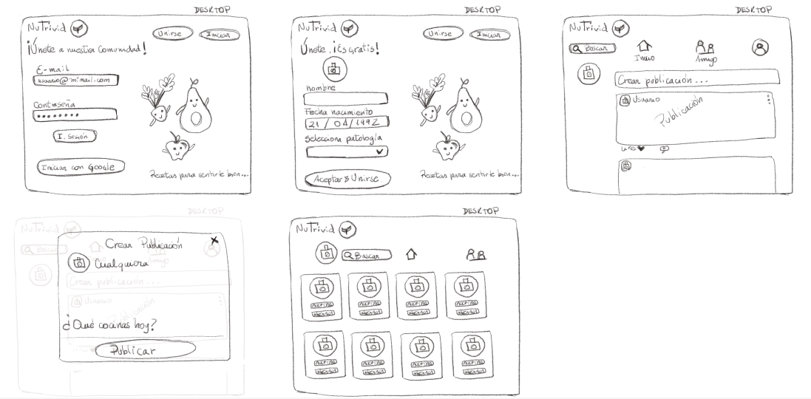
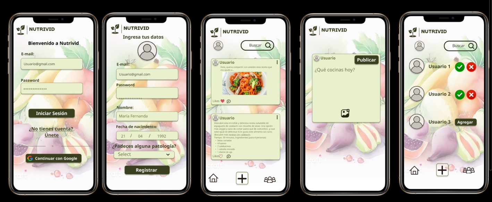
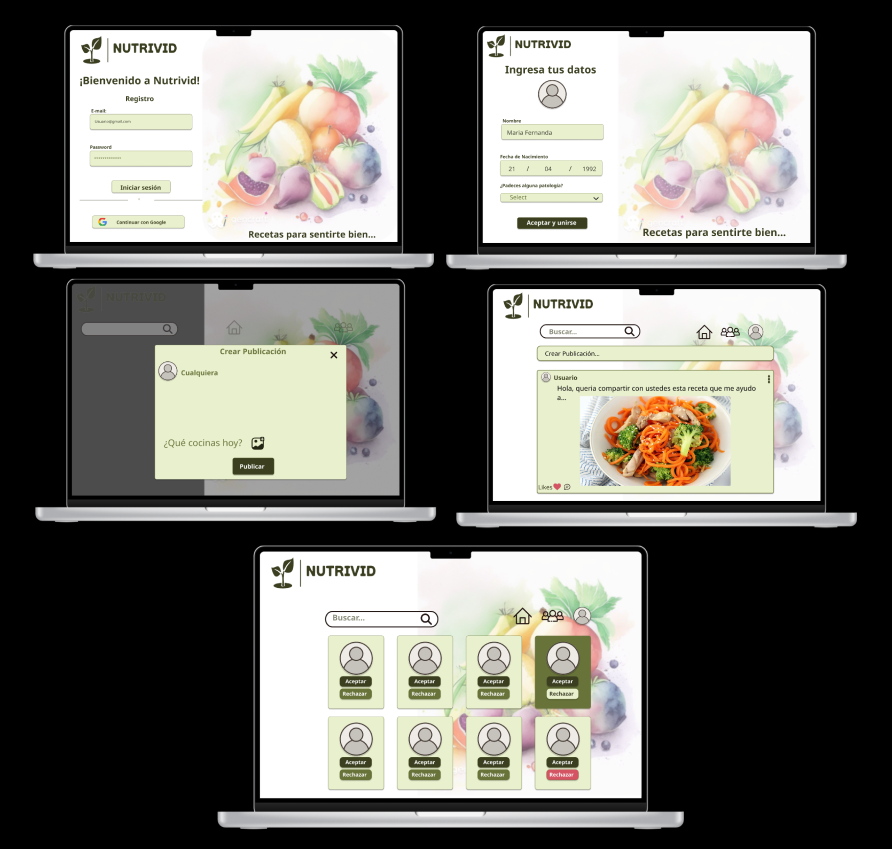
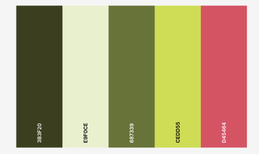

# Nutrivid - Social Network

## Índice

* [1. Introducción](#1-introducción)
* [2. Usuarios](#2-usuarios)
* [3. Historias de Usuario](#3-historias-de-usuario)
* [4. Prototipos](#4-prototipos)
* [5. Pruebas de usabilidad](#5-pruebas-de-usabilidad)
* [6. Pruebas unitarias](#6-pruebas-unitarias)
* [7. Interfaz](#7-interfaz)

## 1. Introducción

La red social Nutrivid es una single page application enfocada en la alimentación. La idea principal es crear un espacio para que diferentes usuarios puedan compartir recursos, instancias o situaciones en común.
Está desarrollada en Javascript vanilla en conjunto con Firebase. Diseñado con enfoque mobile first.

## 2. Usuarios

Nutrivid está creada pensando en un usuario que padece una o más patologías de origen gastrointestinal o alguna enfermedad cuya sintomatología se manifiesta también a nivel gástrico. Es un espacio que intenta ser seguro para compartir estilos de alimentación y/o recetas que puedan ayudar a mejorar o alivianar los síntomas que padecen los usuarios. No está administrada ni guiada por médicos, las opiniones que se compartan en ella, así como las recetas especiales y/o recomendaciones son de estricta responsabilidad de quienes las emiten.

## 3. Historias de usuario

Cada historia de usuario debe cumplir con determinados requisitos antes de trabajar la siguiente.

Definición de terminado: 
Debe ser una SPA |Es responsive | Recibió code review | Se le realizaron test unitarios | Testeo manual | Pruebas de usabilidad | Deploy | Etiquetar la versión de la aplicación.

Criterios de aceptación:
Independientes para cada HU.

### HU1

Yo, como usuario, quiero poder navegar entre las distintas vistas de la aplicación sin tener que recargar la página ni usar redirecciones.

Criterios de aceptación: 
1. El usuario puede moverse entre las distintas vistas de la aplicación sin necesidad de recargar.
Login | Register | Muro

### HU2
Yo, como usuario, quiero poder crear una cuenta que me permita ingresar al sitio con mi correo y contraseña y que también me dé la opción de ingresar con mi cuenta existente de Google.

Criterios de aceptación: 
1. El usuario puede crear una cuenta e ingresar en el sitio Nutrivid utilizando un email válido y una contraseña que contenga un mínimo de seis caracteres. 
2. No puede reutilizar un email ya registrado. 
3. Se envía un correo de verificación de cuenta.

### HU 3
Yo, como usuario, quiero poder publicar mis recetas y/o recomendaciones con enfoque en la salud para que puedan ser visibles para la comunidad que integra Nutrivid.

Criterios de aceptación: 
1. El usuario puede escribir en el textarea designado para tal motivo. 
2. Es posible hacer saltos de línea al escribir.
3. Existe un botón claramente visible que permite realizar la publicación.
4. Los posts se ordenan desde el más reciente al más antiguo.

### HU 4
Yo, como usuario, quiero tener la opción de editar o borrar mis post en caso de que me arrepienta de haber enviado algo incompleto o erróneo.

Criterios de aceptación: 
1. El usuario puede editar o eliminar los posts que le pertenezcan.
2. Las opciones de editar/borrar son visibles únicamente para el creador del post.

### HU 5
Yo, como usuario, estoy interesado en tener la opción de dar likes o “me gusta” a las publicaciones que aparezcan y me parezcan atractivas o interesantes.

Criterios de aceptación: 
1. El usuario puede dar click en un corazón para demostrar apoyo o gusto por el post escrito.
2. Solamente se puede dar un like por posteo, si vuelve a clickear el corazón, el like desaparece.

## 4. Prototipos

### 4.1 Prototipos baja fidelidad para Móvil y Desktop:

### 4.2 Prototipos alta fidelidad para Móvil y Desktop:

### 4.3 Paleta de colores utilizada

## 5. Pruebas de usabilidad

Se realizaron diversas pruebas de usabilidad, tanto con usuarios acostumbrados al uso de redes sociales como a gente que las utiliza muy poco o no sabe tanto de su manejo. Incorporamos las recomendaciones que aportaban contenido y eran realizables dentro de los plazos estipulados para el término del proyecto.

Recomendaciones evaluadas y aceptadas:

1.0 “—Sería interesante poder subir una imagen de las recetas que  se están compartiendo. Si no tengo una guía visual sobre cómo debe verse el producto final, me costará realizarla”
Si bien, este punto estaba comprendido dentro de la edición especial de la aplicación, se incorporó dentro de las pruebas de usabilidad, ya que para un porcentaje no menor de personas fue catalogado como —Muy importante—.

1.1 “—Me incomoda no poder cerrar la creación de post dando click fuera de la aplicación, tengo que recargar el sitio y se vuelve tedioso”
Punto que inicialmente no se había considerado, pero al recibir las recomendaciones quedó en evidencia que era necesario implementarlo para facilitar la navegación dentro del sitio.

## 6. Pruebas unitarias

## 7. Interfaz

¿Estás interesado en conocer el proyecto Nutrivid? Puedes hacer click en el siguiente enlace: [NUTRIVID](https://nutrivid-social-network-rsa.vercel.app/)

